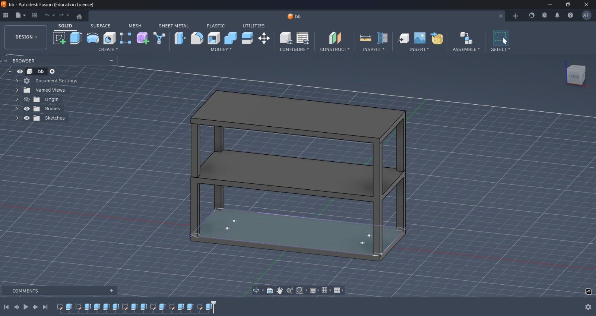
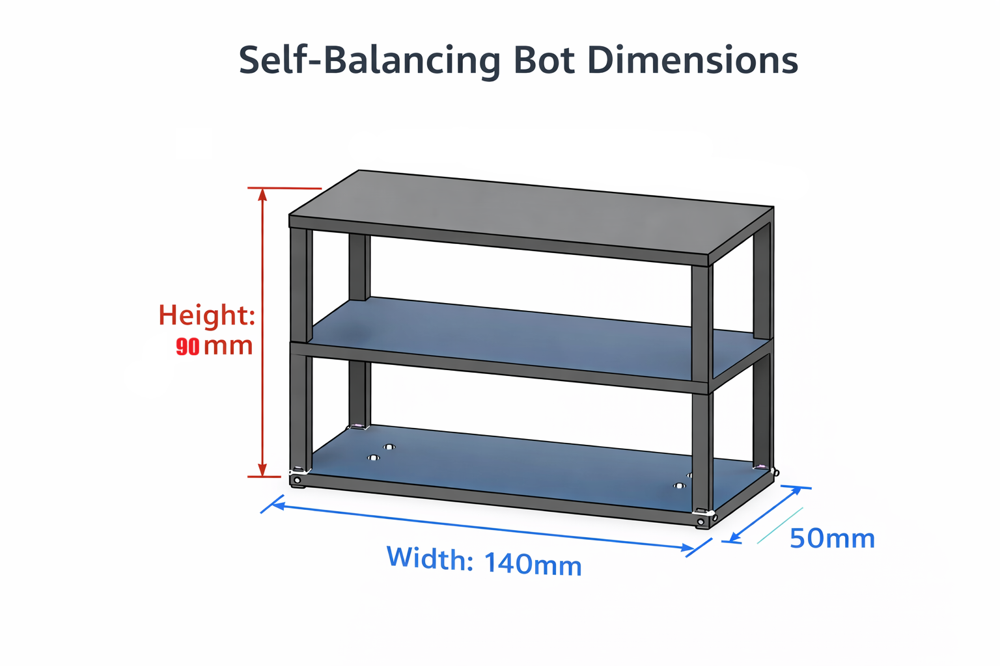

# 🤖 Self Balancing Robot

A two-wheel self-balancing robot built as a hands-on control systems experiment.

This project was not just about making a robot stand —  
it was about understanding instability, center of gravity, PID tuning, and real-world noise.

[](https://youtube.com/shorts/97mSizyUbN4)

🎥 Demo Video: https://youtube.com/shorts/97mSizyUbN4

---

# 📌 Why I Built This

In theory, an inverted pendulum is simple.

In practice, it is brutally unstable.

This project was built to:
- Understand real-world PID control
- Study how mechanical design affects control response
- Learn sensor filtering and noise reduction
- Experience failure → debugging → improvement cycle

Full build story available here:

👉 **[Read the Complete Build Journey](TUTORIAL.md)**

---

# 🧠 How It Works (In Simple Terms)

The robot continuously:

1. Reads tilt angle from MPU6050.
2. Calculates the error from vertical.
3. Applies PID correction.
4. Adjusts motor speed instantly.
5. Repeats this loop hundreds of times per second.

If correction is late → it falls.  
If correction is too aggressive → it oscillates.  
Balance exists in between.

---

# 🛠️ Hardware Used

- Arduino UNO
- MPU6050 IMU
- L298N Motor Driver
- 2 × GA25-370 DC Geared Motors
- 12.00V Li-ion Battery
- Custom Two-Level Foam Chassis (later modified)

---

# ⚙️ Mechanical Design Evolution

The first version had two levels and higher center of gravity.

It failed.

After testing and tuning:
- Reduced height
- Improved rigidity
- Removed unnecessary weight
- Repositioned components lower

This improved stability significantly.

| Version | Status |
|---------|--------|
| Two-Level Foam Design | Unstable, oscillating |
| After PID Tuning | Partial Stability |
| Reduced Height Version | Stable & Smooth |



---

# 🔌 Circuit Summary

### MPU6050 → Arduino
- VCC → 5V  
- GND → GND  
- SDA → A4  
- SCL → A5  

### L298N → Arduino
- IN1 → D4  
- IN2 → D2  
- IN3 → D8  
- IN4 → D7  
- EN1 → D5  
- EN2 → D6  

---

# 💻 Software Stack

- Arduino IDE
- Adafruit MPU6050 Library
- PID_v1 Library
- Custom tuning logic

---

# 🎯 Example PID Values

| Parameter | Value |
|------------|--------|
| Kp | 20.0 |
| Ki | 0.5 |
| Kd | 1.2 |

These are not magic numbers.  
They were achieved after multiple crashes and adjustments.

---

## 📂 Project Structure

```
BalancingBot/
│── README.md
│── TUTORIAL.md
│── balancing_bot.ino
│── images/
│   ├── circuit.png
│   ├── robot.jpg
│   ├── Broken.jpeg
│   ├── cad_model.jpeg
│   ├── after_design_change.jpeg
│   ├── chassis.jpeg
│   ├── LCD_update.jpeg
│   ├── dimension.png
```

---

# 🧪 What This Project Really Taught Me

- Control theory behaves differently in real hardware.
- Mechanical instability makes control harder.
- Center of gravity is everything in inverted pendulum systems.
- Noise filtering is not optional.
- PID tuning requires patience.

---

# 🚀 Future Improvements

- Kalman Filter implementation
- Encoder-based speed feedback
- Metal chassis for rigidity
- Bluetooth tuning interface
- Closed-loop velocity + angle control

---

# 👨‍💻 Authors
1) Aryan Gajanan Theng
2) Ayush Kishor Tonape
3) Mohammed Sakib Khalid Shaikh

Electronics & Telecommunication Engineering Third year students. We buid this project during our internship at Motion Robotics in Pune.

---

If this project helped or inspired you, consider giving it a ⭐