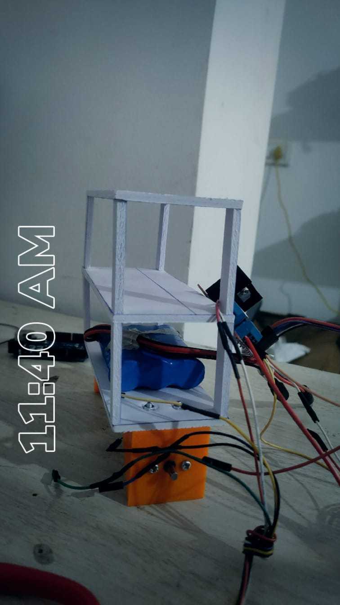
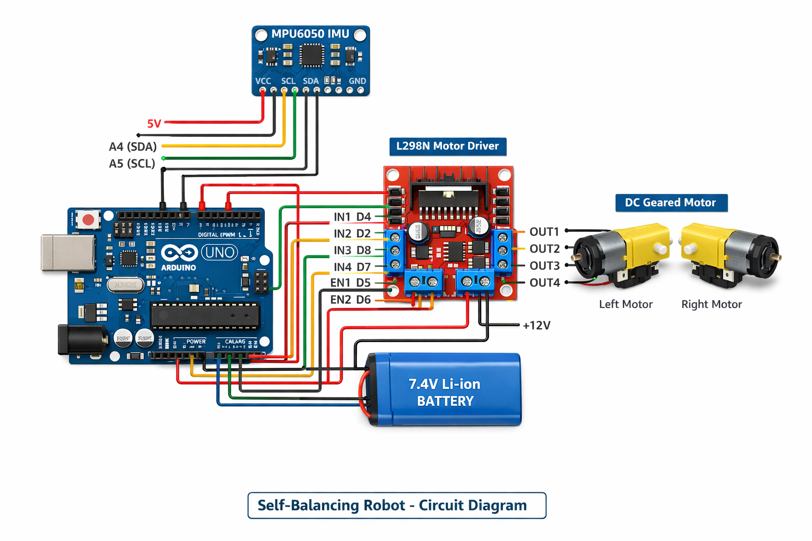
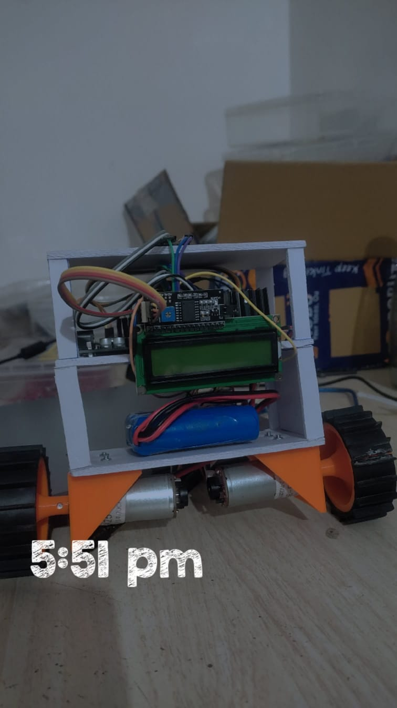
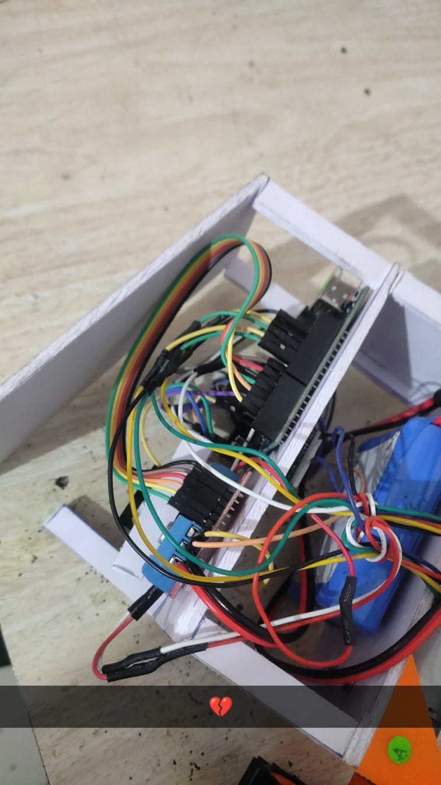
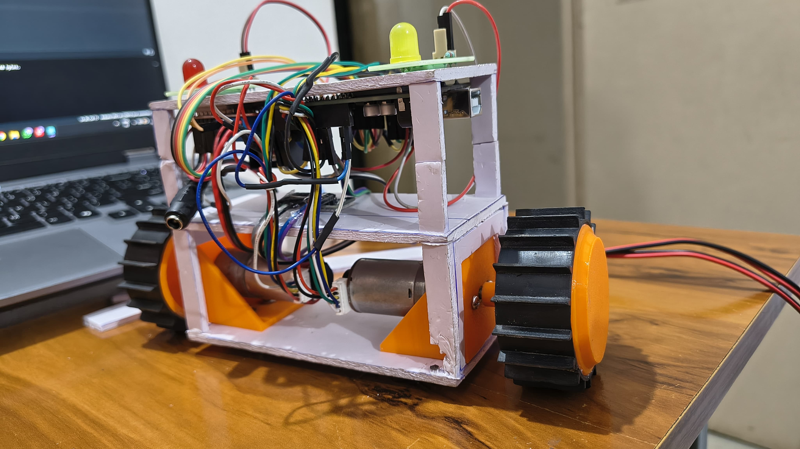

# 🛠️ Build Journey – From Idea to Stable Balancing

This was not a perfect build on the first try.  
It was a process of experimenting, failing, learning, and improving.

Here is how the balancing bot evolved.

---

## 🚧 Stage 1: Building the First Chassis

We started by designing a **two-stage chassis** using foam board as a lightweight structure.

- Cut foam sheets according to the designed dimensions.
- Created two levels to distribute components.
- Mounted four vertical supports to hold both stages.

At this stage, the structure was light but not very rigid.

---

## ⚙️ Stage 2: Mounting Motors & Wheels

- Mounted GA25-370 DC geared motors at the bottom.
- Ensured both motors were aligned properly.
- Fixed wheels tightly to avoid wobbling.

Proper alignment was critical for straight balancing.

---

## 🔌 Stage 3: Assembling Electronics

We mounted:
- Arduino UNO
- L298N Motor Driver
- MPU6050 IMU Sensor

We followed the circuit diagram exactly as shown:

All connections were double-checked before powering ON.

---

## 📟 Stage 4: Sensor Testing Using LCD

Before attempting balancing, we wanted to verify sensor accuracy.

- Connected MPU6050.
- Printed angle values on Serial Monitor.
- Temporarily used an LCD to monitor live angle data.
- Observed noise and fluctuations.

### 🔎 What We Learned:
- Sensor alignment matters a lot. We firstly mount it at the top of bot then we mount sensor at middle stage where it worked better.
- Loose mounting increases noise.
- Vibrations affect readings.

After becoming confident with angle values and filtering noise,  
we removed the LCD to reduce extra weight and wiring complexity.

---

## ⚠️ Stage 5: First Balancing Attempt (Failure)

We uploaded the PID code and powered the bot.

Result?

It tried to balance…  
Then suddenly oscillated heavily and fell.

The foam chassis cracked during the fall.

### ❌ Problems Observed:
- Too much oscillation (high Kp)
- Delay in correction
- Structure not rigid enough
- Center of gravity too high

---

## 🔧 Stage 6: PID Tuning & Structural Changes

We started tuning:

- Reduced Kp slightly.
- Increased Kd to reduce oscillations.
- Adjusted Ki carefully.
- Tightened mechanical joints.

We achieved **partial stability**.

But something still felt wrong.

---

## 🧠 Major Realization

The robot was **top-heavy**.

The second level increased the height of the center of gravity,  
making balancing harder.

So we made a bold decision:

👉 We removed one stage.

---

## 🏗️ Stage 7: Simplified Single-Level Design

- Removed upper foam platform.
- Repositioned components lower.
- Reduced overall height.
- Improved rigidity.

Now the bot looked cleaner and more stable.

---

## 🎯 Final Result

After further tuning:

- Oscillations reduced.
- Response became smoother.
- Robot achieved near-stable balancing.

It is not perfect — but it works.

And more importantly, we understand it.

---

# 📚 What This Project Taught Us

- Mechanical design affects control performance.
- Center of gravity is critical in inverted pendulum systems.
- PID tuning requires patience.
- Structural rigidity matters as much as code.
- Failing early helps improve faster.

---

# ✅ Final Check Before Power ON

- All grounds common?
- Motors wired correctly?
- Sensor aligned vertically?
- PID tuned safely?
- Structure rigid?

---

This project was not just about building a robot.  
It was about understanding control systems in real life.
